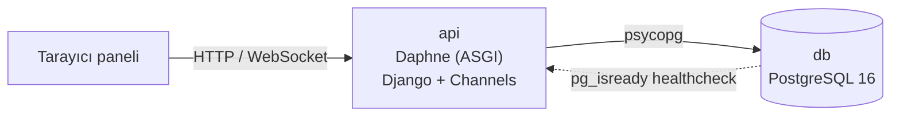
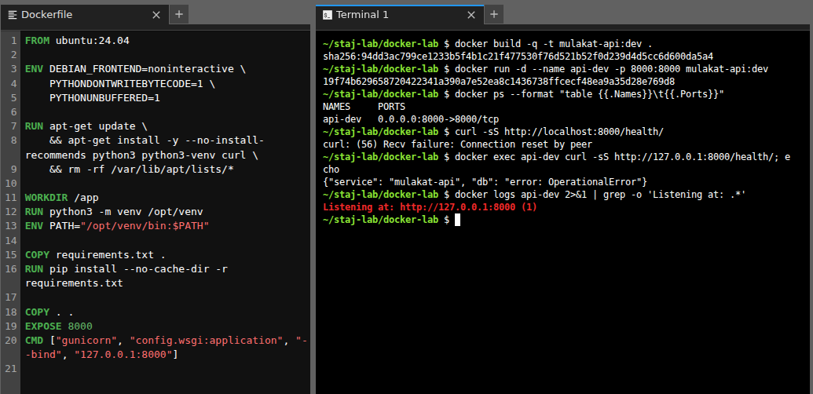
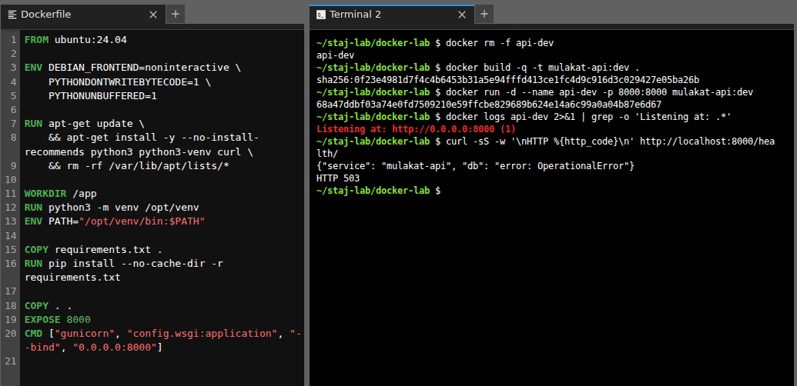
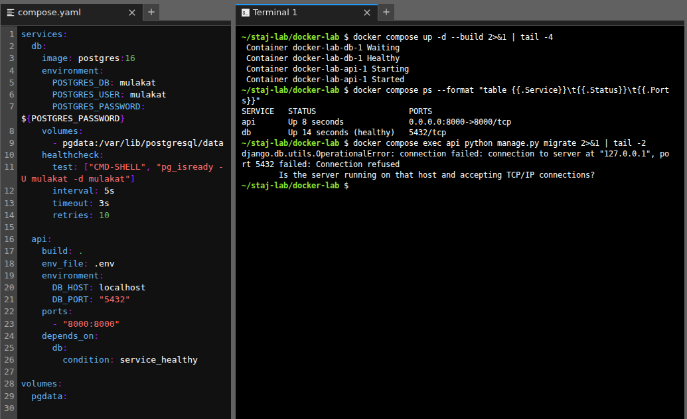
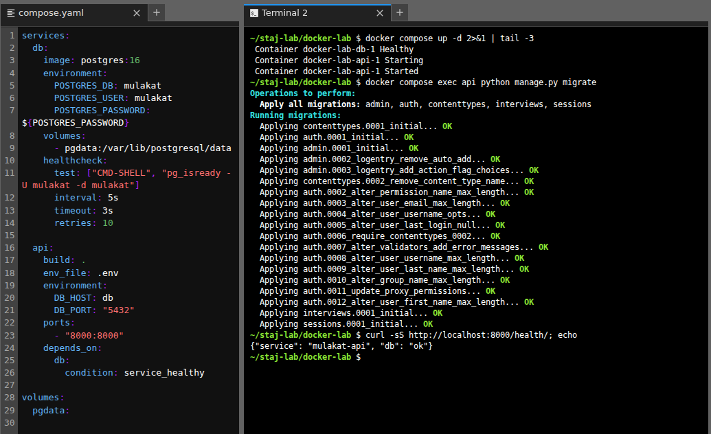
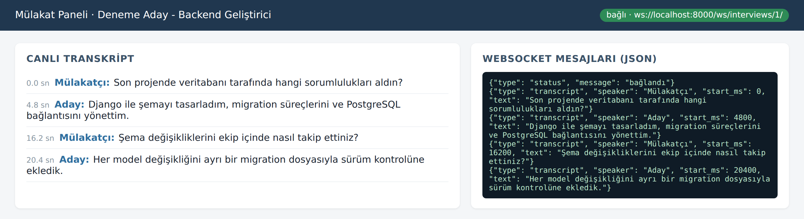
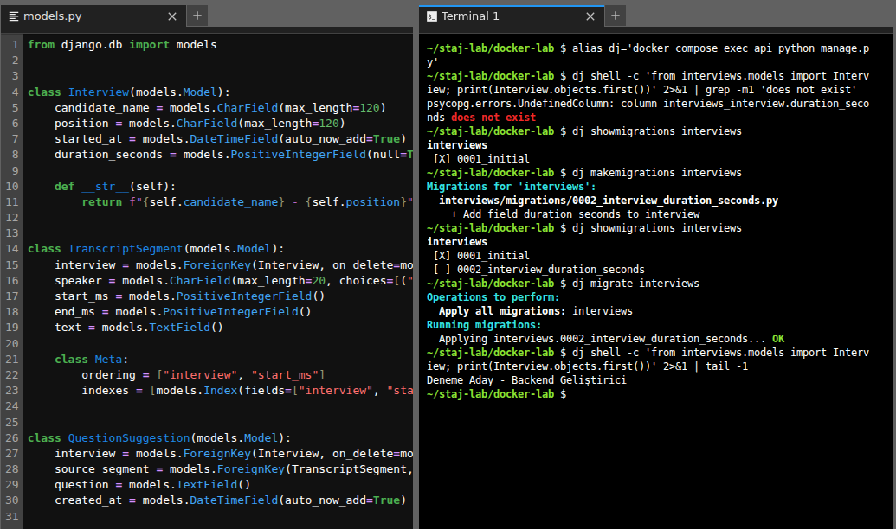
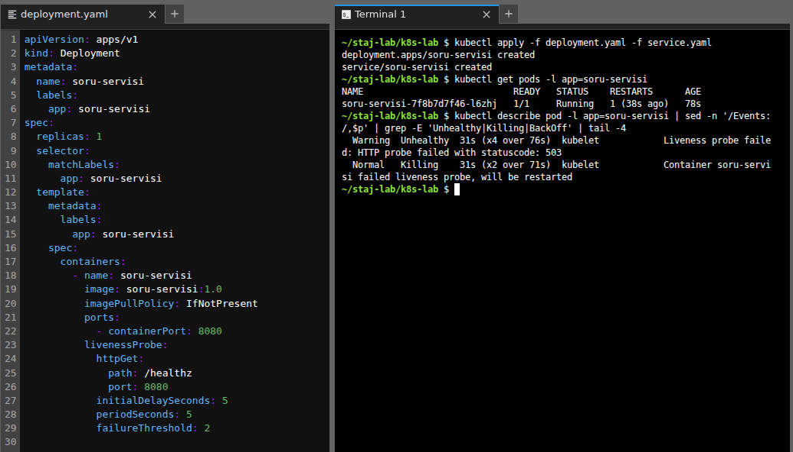
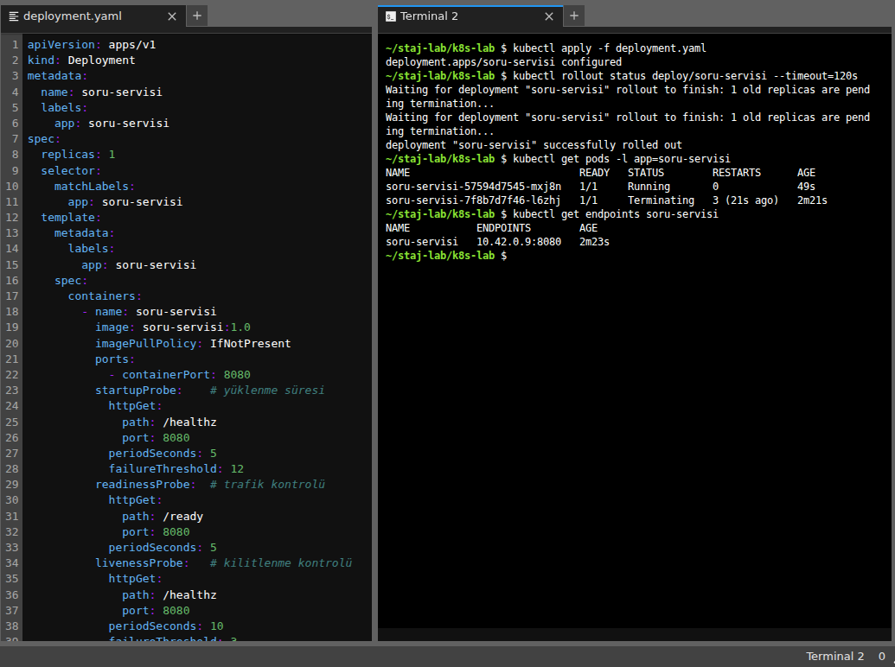

# M53 Mülakat Altyapısı · Docker, Compose ve Kubernetes


Bu repo, [M53 multimodal mülakat sisteminin](https://github.com/alimdemir/m53-multimodal-interview) backend servisini konteynerleştirme, PostgreSQL ile birlikte çalıştırma ve model servislerini Kubernetes'te sağlık kontrolleriyle yayınlama üzerine yaptığım çalışmaları içeriyor. AVD Teknoloji Danışmanlık'taki stajımın (2026) ilk haftasında hazırladım. Her adımda karşılaştığım hatalar ve çözümleri aşağıda.

## İçerik

| Klasör | Açıklama |
|---|---|
| [`api/`](api) | Django 5.2 + Channels API. Mülakat, transkript parçası ve soru önerisi modelleri, `/health/` ucu, WebSocket transkript paneli, `Dockerfile`, `compose.yaml` (PostgreSQL 16 + healthcheck) |
| [`k8s/`](k8s) | Modeli yüklerken geç hazır olan örnek servis; startup/readiness/liveness probe'lu `Deployment` ve `Service` |
| [`docs/ekran_goruntuleri/`](docs/ekran_goruntuleri) | Çalışma sırasında aldığım ekran görüntüleri |

## Mimari



- **HTTP**: kayıt oluşturma, sorgulama ve `/health/` (veritabanına `SELECT 1` atar, ulaşamazsa `503` döner)
- **WebSocket** (`/ws/interviews/<id>/`): panel açıldığında transkript parçaları sırayla JSON olarak akar
- **Şema**: `Interview 1─N TranscriptSegment`, `QuestionSuggestion → TranscriptSegment (SET_NULL)`, `(interview, start_ms)` indeksi

## Hızlı başlangıç

```bash
cd api
cp .env.example .env                 # parolaları değiştirin; .env repoya girmez
docker compose up -d --build --wait
docker compose exec api python manage.py migrate
curl http://localhost:8000/health/
# {"service": "mulakat-api", "db": "ok"}
```

Deneme verisi için `docker compose exec api python manage.py createsuperuser` ile `/admin/` paneline girip bir mülakat ve transkript parçaları ekleyin. Ardından `http://localhost:8000/panel/<id>/` sayfasını açın.

Docker olmadan hızlı test (SQLite):

```bash
cd api && python -m venv .venv && .venv/bin/pip install -r requirements.txt
DB_ENGINE=sqlite .venv/bin/python manage.py test -v 2
```

## Kubernetes: model servisi ve probe'lar

`k8s/app.py`, açılışta modeli belleğe yüklüyormuş gibi yaklaşık 25 saniye bekleyen bir servis. Yükleme bitene kadar `/healthz` ve `/ready` uçları `503` döner.

```bash
docker build -t soru-servisi:1.0 k8s/
kind load docker-image soru-servisi:1.0      # minikube: minikube image load soru-servisi:1.0
kubectl apply -f k8s/deployment.yaml -f k8s/service.yaml
kubectl rollout status deployment/soru-servisi
```

| Probe | Görevi | Ayar |
|---|---|---|
| `startupProbe` | Yükleme için süre tanır; bitene kadar diğer probe'lar çalışmaz | 12 × 5 sn = 60 sn |
| `readinessProbe` | Pod hazır değilken Service trafiği göndermez | 5 sn aralık |
| `livenessProbe` | Kilitlenen konteyneri yeniden başlatır | 3 hata × 10 sn |

## Karşılaştığım sorunlar ve çözümleri

| Belirti | Neden | Çözüm |
|---|---|---|
| `curl: Connection reset by peer`, konteynerin içinden istek çalışıyor | Sunucu yalnızca `127.0.0.1` adresini dinliyordu | Bağlama adresini `0.0.0.0:8000` yaptım |
| `migrate` → `Connection refused` | Compose içinde `localhost`, backend konteynerinin kendisini gösteriyor | `DB_HOST=db` (servis adı) |
| API veritabanından önce açılıyor | `depends_on` yalnızca başlatma sırasını belirliyor | `pg_isready` healthcheck + `condition: service_healthy` |
| `column ... does not exist` | Model değişti ama migration uygulanmadı | `makemigrations` → `showmigrations` → `migrate` |
| WebSocket loglarında `ı` gibi kaçışlar | `json.dumps` varsayılanı `ensure_ascii=True` | Consumer'da `ensure_ascii=False` |
| Pod model yüklenmeden yeniden başlıyor (CrashLoopBackOff) | Yalnızca liveness probe vardı | `startupProbe` + ayrı `readinessProbe` + kaynak sınırları |

## Testler

`api/interviews/tests.py` altında 7 test var: sağlık ucu, transkript sıralaması, silme davranışları (`CASCADE` / `SET_NULL`), panel görünümü ve WebSocket akışı (`channels.testing.WebsocketCommunicator`).

## Ekran görüntüleri

| | |
|---|---|
| <br/>Uygulama `127.0.0.1` dinlediği için dışarıdan erişilemiyor | <br/>`0.0.0.0` sonrası erişim |
| <br/>`localhost` ile bağlantı hatası | <br/>Servis adı + healthcheck |
| <br/>WebSocket transkript paneli | <br/>Migration akışı |
| <br/>Yalnız liveness probe: yeniden başlatma döngüsü | <br/>startupProbe ile sorunsuz rollout |

## Lisans

[MIT](LICENSE)
